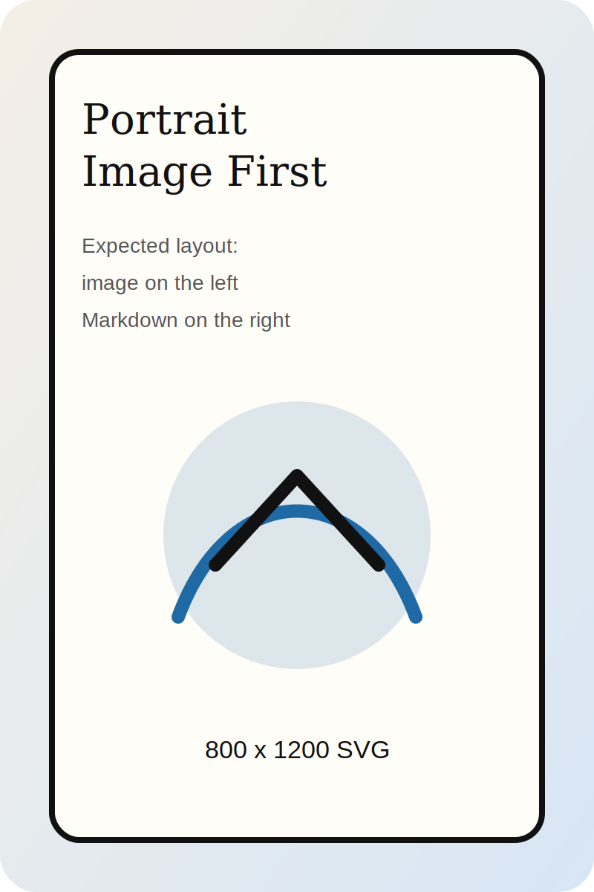
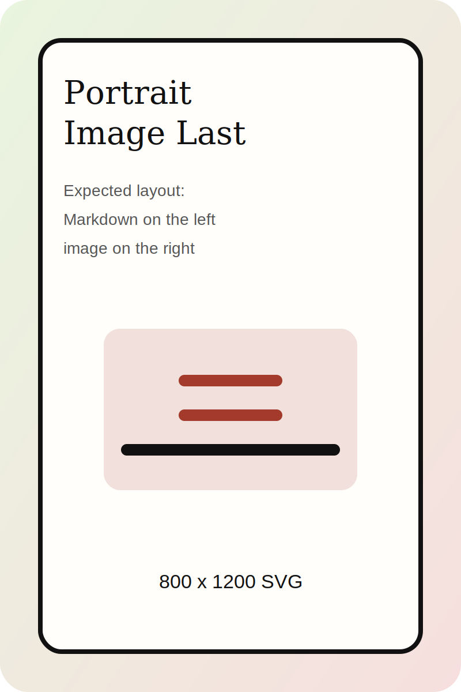

# clicker.page

clicker.page turns Markdown into beautiful presentations.

Throw a Markdown file or a link to a Markdown file onto it.

---

## Start Here

- `ArrowRight` / `ArrowDown`: next slide
- `ArrowLeft` / `ArrowUp`: previous slide
- click or swipe: navigate
- `+` / `-`: content font size
- `☀` / `☾`: light or dark mode
- theme buttons: switch visual language

The source URL stays visible in the header and can be copied or opened directly.

---

## Markdown Becomes Layout

Slides are split by natural authoring markers:

- `#` and `##` headlines
- horizontal rules `---`

Markdown then becomes a styled presentation surface with post-render layout rules.

---

## Images Can Drive The Slide



Portrait images can trigger split-screen layouts.

- image first: image on the left
- image last: image on the right
- full slide stays Markdown-driven, not Mermaid-driven

---

## Landscape Images Can Become Hero Slides


If a slide is only a headline plus one landscape image, it becomes a full-image hero slide.

- headline is painted over the image
- color is adapted to the visible image region
- great for title slides and section dividers

---

## Text Can Be Enhanced

Markdown emphasis and semantic patterns are styled after rendering:

- `**bold**` becomes marker-like emphasis
- chains like intake -> refine -> deliver get a warp effect
- `inline code` gets theme-aware chip styling

The pipeline lights up when a sentence contains a chain like intake -> refine -> deliver, and `updateSourceQuery(...)` stays readable inside running prose.

---

## Code Blocks Become Presentation Elements

```js
function renderSlideInto(targetEl, slideMarkdown, slideIndex, renderToken, options) {
  const renderedTemplate = document.createElement('template');
  renderedTemplate.innerHTML = renderMarkdown(slideMarkdown);
  mountRenderedContent(targetEl, renderedTemplate.content);
}
```

- line numbers
- themed code surfaces
- copy button
- automatic width fitting

---

## Tables Are Styled, Too

| Feature | Result | Q1 | Q2 |
| --- | --- | ---: | ---: |
| header bands | stronger structure | 12 | 18 |
| row rhythm | easier scanning | 24 | 31 |
| image-only tables | borderless stitched gallery | 4 | 6 |

|  |  |
| --- | --- |
|  |  |
|  |  |

---

## Bullet Lists Can Reveal Progressively

- first bullet is visible immediately
- next bullets appear step by step
- nested content belongs to its parent bullet
- code blocks can live inside a revealed bullet
- tables and image sets can live inside a revealed bullet

---

## Local And Remote Markdown Both Work

- drop a local `.md` file
- drop a markdown URL
- keep the current source in the URL
- reload directly into the same deck
- optionally watch a local source file in local dev mode

This makes `README.md` files, notes, docs, and demos presentation-ready without a second slide tool.

---
## One Source Of Truth

This `README.md` is the default clicker.page presentation.

The example decks still exist for focused testing, but the main product story now lives here.
